# 🏗️ Local Labour Connect

> A platform connecting **daily-wage labourers** with **local contractors** — built with Next.js, PostgreSQL, Prisma & NextAuth.

---

## Table of Contents

- [High-Level Architecture](#high-level-architecture)
- [Component Diagram](#component-diagram)
- [Tech Stack](#tech-stack)
- [Core Modules](#core-modules)
- [Database Schema](#database-schema)
- [Entity Relationship Diagram](#entity-relationship-diagram)
- [RBAC — Role-Based Access Control](#rbac--role-based-access-control)
- [Data Flow Diagrams](#data-flow-diagrams)
  - [Registration & Login](#1-registration--login)
  - [Job Posting (Contractor)](#2-job-posting-contractor-only)
  - [Applying to a Job (Labour)](#3-applying-to-a-job-labour-only)
  - [Application Management (Contractor)](#4-application-management-contractor)
- [Route Map & Middleware](#route-map--middleware)
- [Search & Filter (MVP)](#search--filter-requirements-mvp)
- [Phase 2 — Planned Services](#phase-2--planned-services)
- [Getting Started](#getting-started)

---

## High-Level Architecture

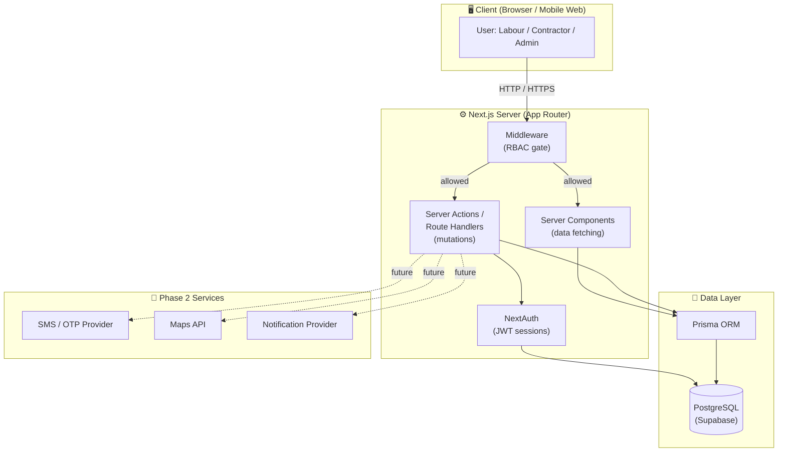

---

## Component Diagram

Detailed logical view of how each layer communicates:

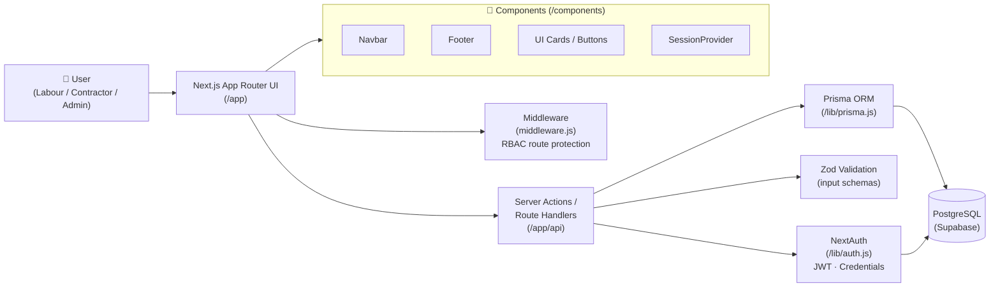

---

## Tech Stack

| Layer | Technology | Version |
|---|---|---|
| **Framework** | Next.js (App Router) | 16.1.6 |
| **React** | React | 19.2.3 |
| **Auth** | NextAuth (Credentials) | 4.x |
| **ORM** | Prisma Client | 7.x |
| **Database** | PostgreSQL (Supabase) | — |
| **Styling** | Tailwind CSS | 4.x |
| **Icons** | Lucide React | 0.563 |
| **Password hashing** | bcryptjs | 2.x |

---

## Core Modules

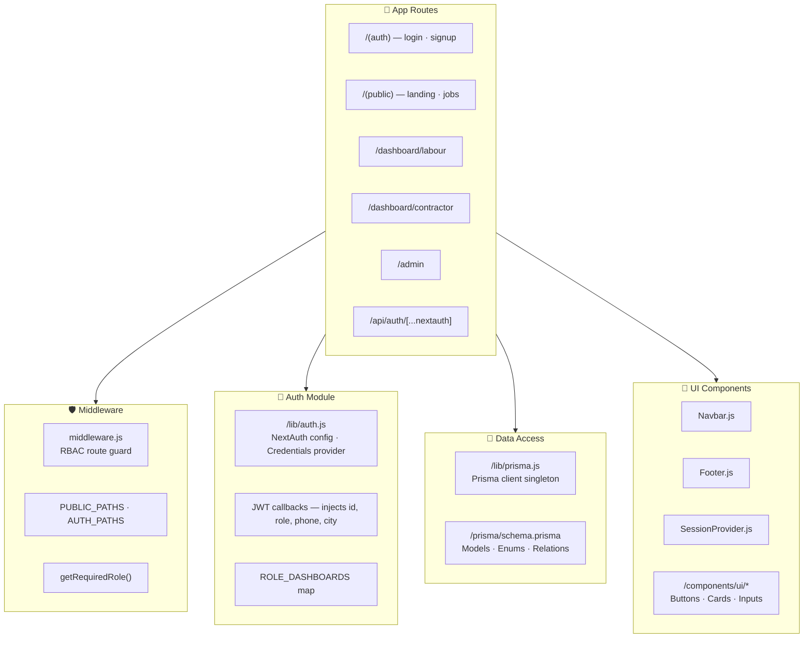

### Module boundaries

| Module | Path | Responsibility |
|---|---|---|
| **Auth** | `/lib/auth.js` | Session, role extraction, route protection helpers |
| **Data Access** | `/lib/prisma.js` | Prisma client singleton (connection pooling) |
| **Schema** | `/prisma/schema.prisma` | All models, enums, relations, constraints |
| **Middleware** | `/middleware.js` | Edge-level RBAC before page render |
| **UI Components** | `/components/*` | Reusable Navbar, Footer, cards, language toggle |
| **App Routes** | `/app/*` | Pages (Server Components) & API routes |

---

## Database Schema

### Enums

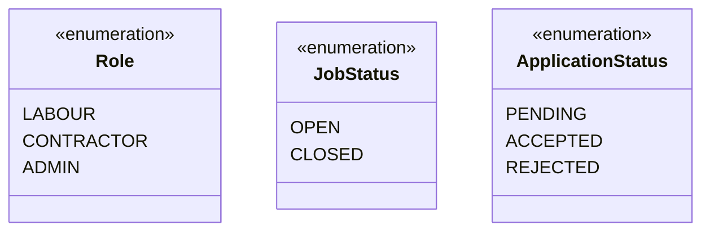

### Models overview

| Model | Key Fields | Constraints |
|---|---|---|
| **User** | `id` (UUID), `name`, `phone`, `role`, `city`, `password?`, `banned` | `phone` UNIQUE |
| **LabourProfile** | `id`, `userId`, `skill`, `experience`, `rating`, `verified` | `userId` UNIQUE (1:1) |
| **ContractorProfile** | `id`, `userId`, `companyName`, `rating`, `verified` | `userId` UNIQUE (1:1) |
| **Job** | `id`, `contractorId`, `title`, `description`, `skillRequired`, `city`, `wage`, `status` | FK → `User` |
| **Application** | `id`, `jobId`, `labourId`, `status` | `@@unique([jobId, labourId])` |

---

## Entity Relationship Diagram

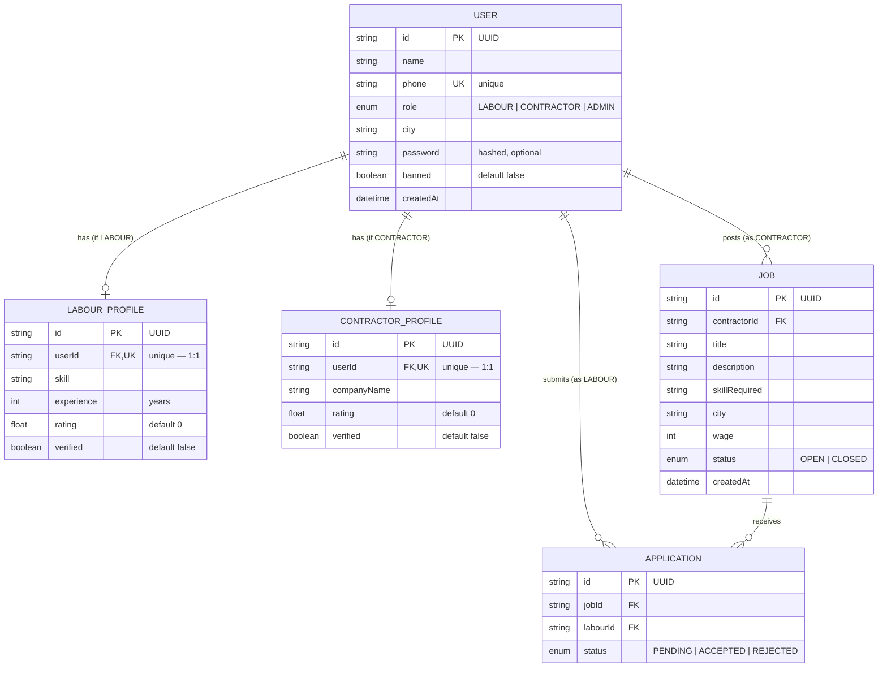

---

## RBAC — Role-Based Access Control

> **Important**: RBAC is enforced **both** in middleware (UX) **and** on the server (real security).

### Permission matrix

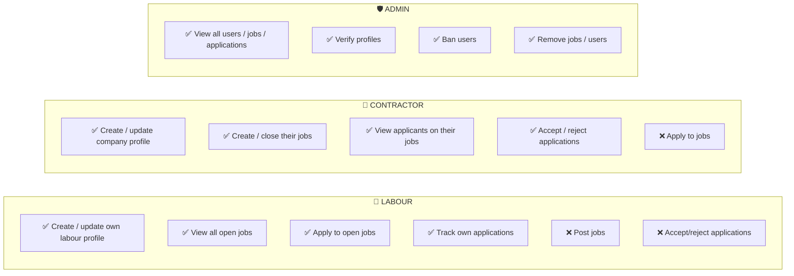

### Enforcement layers

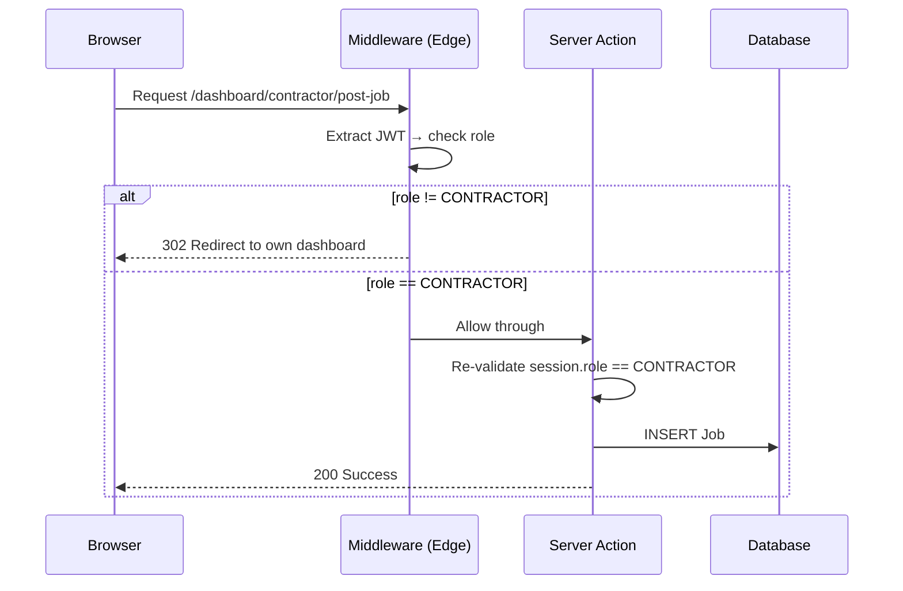

### Route protection map

| Route Pattern | Required Role | Enforced By |
|---|---|---|
| `/`, `/jobs`, `/login`, `/register` | Public | — |
| `/dashboard/labour/*` | `LABOUR` | Middleware + Server |
| `/dashboard/contractor/*` | `CONTRACTOR` | Middleware + Server |
| `/admin/*` | `ADMIN` | Middleware + Server |
| `/api/auth/*` | Public | NextAuth |

---

## Data Flow Diagrams

### 1. Registration & Login

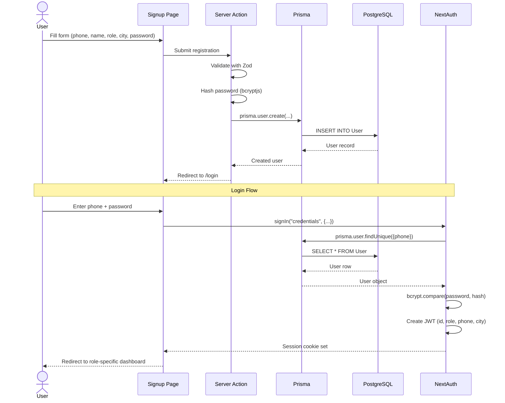

### 2. Job Posting (CONTRACTOR only)

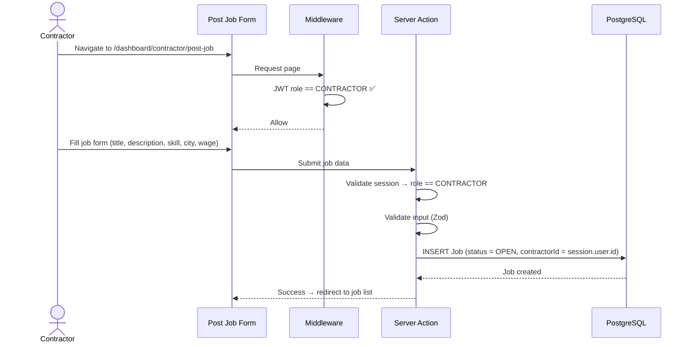

### 3. Applying to a Job (LABOUR only)

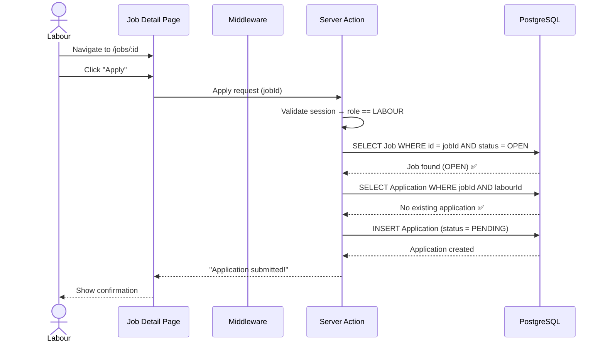

### 4. Application Management (CONTRACTOR)

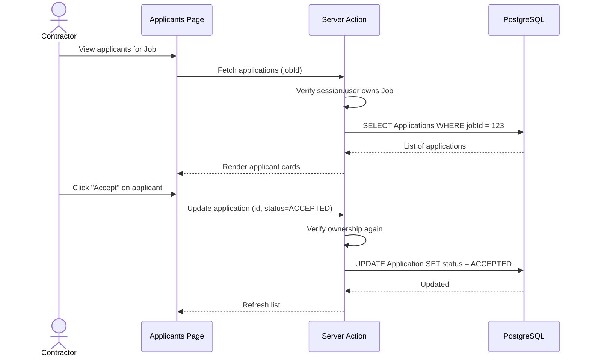

---

## Route Map & Middleware

### Application route structure

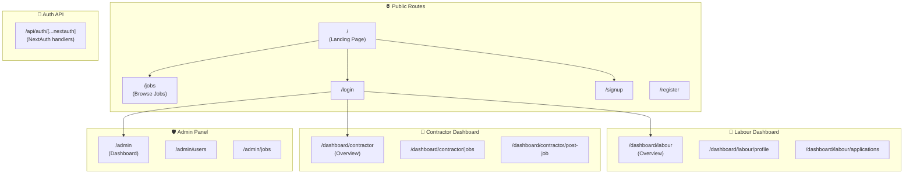

### Middleware flow

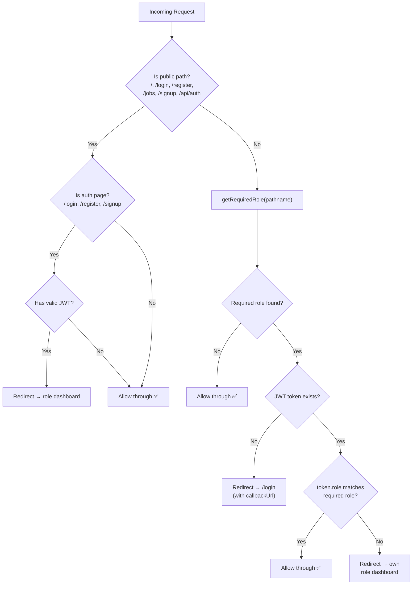

---

## Search & Filter Requirements (MVP)

The jobs listing page (`/jobs`) supports the following filters:

| Filter | Type | Description |
|---|---|---|
| **City** | Dropdown / text | Filter jobs by location |
| **Skill required** | Dropdown / text | Match `skillRequired` field |
| **Wage range** | Range slider / min-max | Filter by `wage` (min ≤ wage ≤ max) |
| **Title search** | Text input | Case-insensitive `LIKE` search on `title` |
| **Pagination** | Cursor / offset | Page through results (default 10 per page) |

### Filter query flow

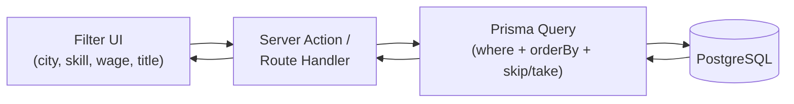

### Example Prisma query structure

```javascript
const jobs = await prisma.job.findMany({
  where: {
    status: "OPEN",
    ...(city    && { city: { contains: city, mode: "insensitive" } }),
    ...(skill   && { skillRequired: { contains: skill, mode: "insensitive" } }),
    ...(title   && { title: { contains: title, mode: "insensitive" } }),
    ...(minWage && { wage: { gte: parseInt(minWage) } }),
    ...(maxWage && { wage: { lte: parseInt(maxWage) } }),
  },
  orderBy: { createdAt: "desc" },
  skip: (page - 1) * PAGE_SIZE,
  take: PAGE_SIZE,
});
```

---

## Phase 2 — Planned Services

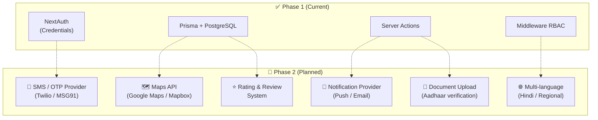

---

## Getting Started

### Prerequisites

- Node.js ≥ 18
- PostgreSQL database (or Supabase project)
- npm / yarn / pnpm

### Setup

```bash
# 1. Clone the repository
git clone <repo-url>
cd local-labour-connect

# 2. Install dependencies
npm install

# 3. Configure environment variables
cp .env.example .env
# Edit .env with your DATABASE_URL, NEXTAUTH_SECRET, etc.

# 4. Generate Prisma client
npx prisma generate

# 5. Run migrations
npx prisma migrate dev

# 6. (Optional) Seed the database
node prisma/seed.js

# 7. Start development server
npm run dev
```

### Environment variables

| Variable | Description |
|---|---|
| `DATABASE_URL` | PostgreSQL connection string |
| `NEXTAUTH_SECRET` | Random secret for JWT signing |
| `NEXTAUTH_URL` | Base URL of the app (e.g. `http://localhost:3000`) |

---

## Project Structure

```
local-labour-connect/
├── app/
│   ├── (auth)/              # Login & signup pages
│   ├── (public)/            # Public landing & job listings
│   ├── admin/               # Admin panel (ADMIN only)
│   ├── api/                 # NextAuth API route
│   ├── dashboard/           # Role-specific dashboards
│   │   ├── labour/          # Labour dashboard pages
│   │   └── contractor/      # Contractor dashboard pages
│   ├── globals.css
│   └── layout.js            # Root layout
├── components/
│   ├── Navbar.js
│   ├── Footer.js
│   ├── SessionProvider.js
│   └── ui/                  # Reusable UI primitives
├── lib/
│   ├── auth.js              # NextAuth configuration
│   ├── prisma.js            # Prisma client singleton
│   └── utils.js             # Utility helpers
├── prisma/
│   ├── schema.prisma        # Database schema
│   ├── migrations/          # Migration history
│   └── seed.js              # Database seeder
├── middleware.js             # RBAC route protection
├── package.json
└── next.config.mjs
```

---

<p align="center">
  Built with ❤️ for connecting local labourers with opportunities
</p>